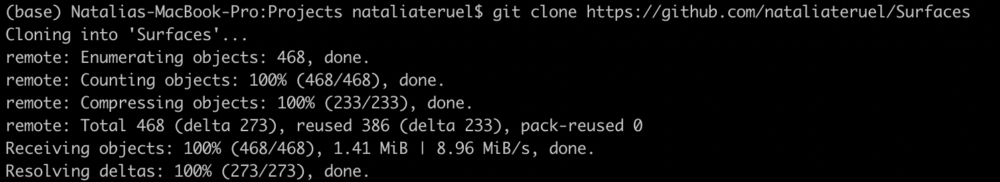

How to install
=====

The first step in using **Surfaces** is to install Python. Details for installing Python can be found on the `Python downloads page <https://www.python.org/downloads/>`_.

Another essential step is to install `Pymol <https://pymol.org/2/>`_ by following the instructions for your operating system.

.. tip::

	We recommend Pymol installation for any OS as follows:
	
	``conda install -c conda-forge pymol-open-source``
	
	For Windows you must run it on Anaconda Powershell Prompt as Administrator.
	
	For this installation you should first install `Miniconda <https://docs.conda.io/en/latest/miniconda.html#linux-installers>`_ in case you do not have Anaconda installed.
	

To access all **Surfaces** codes, you can clone the repository using `git <https://github.com/git-guides/install-git>`_::

	git clone https://github.com/nataliateruel/Surfaces

or download the **Surfaces** repository at ``https://github.com/nataliateruel/Surfaces``.

There are a few dependencies for **Surfaces**' Python scripts. You can install them by running the following commands using `pip <https://pip.pypa.io/en/stable/installation/>`_::

	cd Surfaces
	pip install -r dependencies.txt
	
or also::

	cd Surfaces
	conda install --file dependencies.txt

.. note::
	
	It is important to install the dependencies for the same version of Python that you plan to use for running the scripts.

Another necessary step is to compile Vcontacts. You can use::
	
   	clang Vcontacts-v1-2.c -o vcon
   
or also::

	gcc -c Vcontacts-v1-2.c
	gcc Vcontacts-v1-2.o -o vcon -lm

.. tip::

	If you are using Windows, make sure to have a functional C compiler installed. For that you might run ``conda install -c conda-forge m2w64-gcc`` on Anaconda Powershell Prompt as Administrator.

.. note::
	
	For the subsequent usage steps, we recommend running your structure analyses within the **Surfaces** directory.
